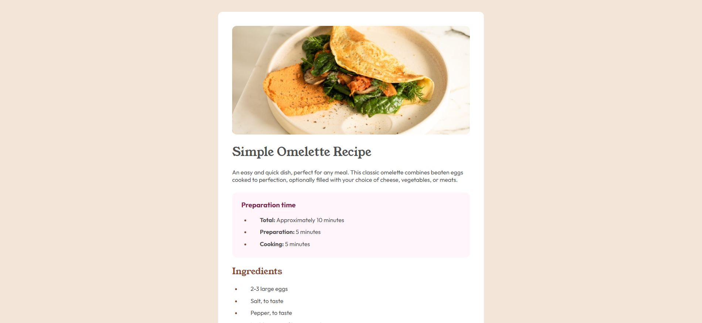

# Frontend Mentor - Recipe page solution

This is a solution to the [Recipe page challenge on Frontend Mentor](https://www.frontendmentor.io/challenges/recipe-page-KiTsR8QQKm). Frontend Mentor challenges help you improve your coding skills by building realistic projects. 

## Table of contents

- [Overview](#overview)
  - [The challenge](#the-challenge)
  - [Screenshot](#screenshot)
  - [Links](#links)
- [My process](#my-process)
  - [Built with](#built-with)
  - [What I learned](#what-i-learned)
  - [Continued development](#continued-development)
  - [Useful resources](#useful-resources)
- [Author](#author)

## Overview

### Screenshot

### Links

- Solution URL: [GitHub](https://github.com/abigailjulie/FrontendMentor_RecipeCard)
- Live Site URL: [Vercel](https://frontendmentorrecipecard.vercel.app/)

## My process

### Built with

- Semantic HTML5 markup
- CSS custom properties
- Flexbox
- CSS Grid
- Mobile-first workflow

### What I learned

I learned about how to adjust the text decoration in lists. This was my first time editing them to this degree and I like the ability to design to this level.

### Continued development

I want more practice working with tables, I haven't gotten to create them much but they are useful and practice makes better!

### Useful resources

- [MDN Tables](https://developer.mozilla.org/en-US/docs/Web/HTML/Element/table) - This has all of the fundamental information on tables.

## Author

- Website - [Abigail Figaro](https://www.abigaildesigns.org)
- Frontend Mentor - [@abigailjulie](https://www.frontendmentor.io/profile/abigailjulie)

